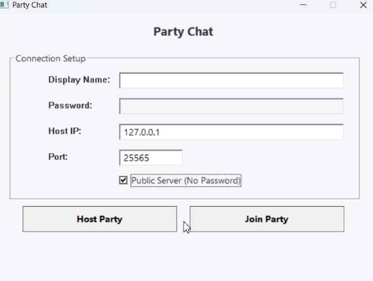

# quickerchatting
uses p2p to connect and you can chat faster with keybind

# how to connect to a Party
1. Enter a display name at the start screen
2. Enter the Host IP
3. Enter the Port
4. Press "Join"

# how to make a Party
1. Enter a display name
2. Enter the Host IP
3. Enter the Port
4. Press "Host"

# how to compile and build
1. run compile.bat first
2. run build.bat next
3. look in "dist" folder for the executable
4. open the executable
### OR if you trust me download the executable from releases
gcc version 14.2.0 (MinGW-W64 x86_64-ucrt-posix-seh, built by Brecht Sanders, r2)
i also included shell files so ok

### python version required
- Python 3.11+

### python libs
these libs are required:
- `sys` (standard library)
- `ctypes` (standard library)
- `os` (standard library)
- `uuid` (standard library)
- `base64` (standard library)
- `keyboard` – for keybind detection
- `PySide6` – for gui components

# note

!! the default ip thats put is your **LOCAL** ip which people can **NOT** connect to, only people connected to your wifi !!

you gotta put ur actual public ip and port forward a port like 25565 and then friend connects using ur ip and port
[tutorial how to port forward](https://www.youtube.com/watch?v=NTLDsEuQlYc)
[website to get your IPv6/IPv4 IP](https://whatismyipaddress.com/)